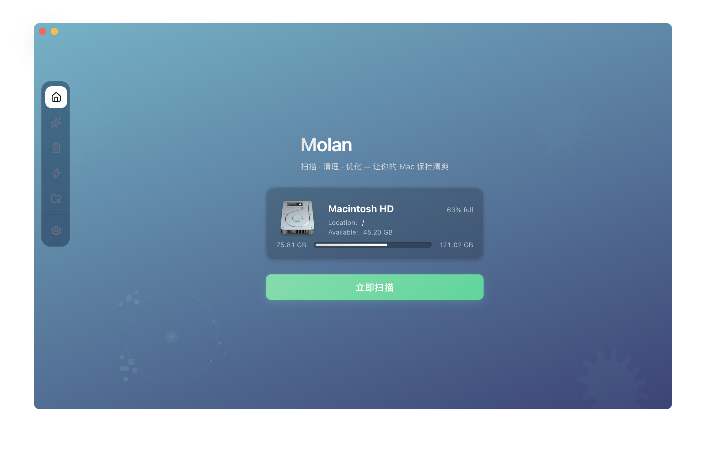
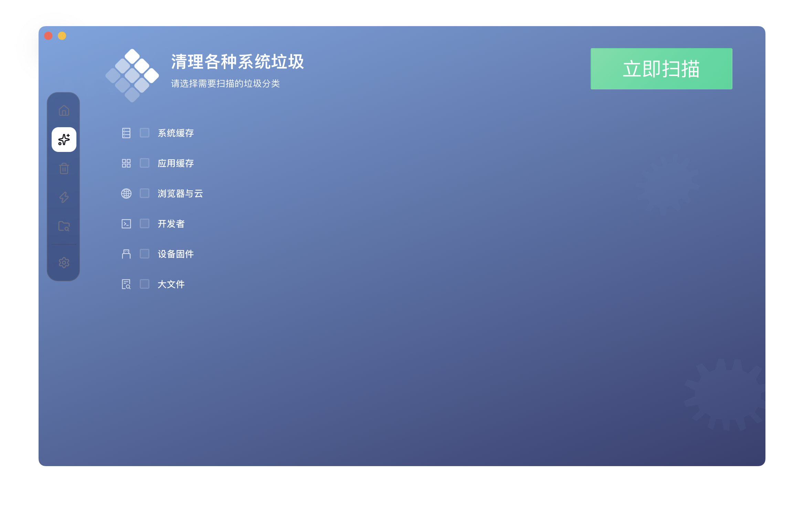
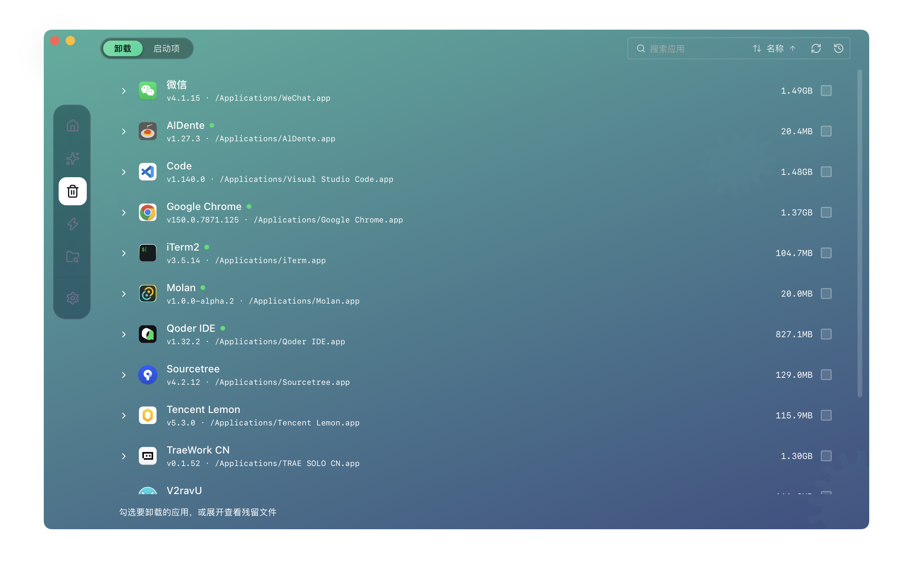
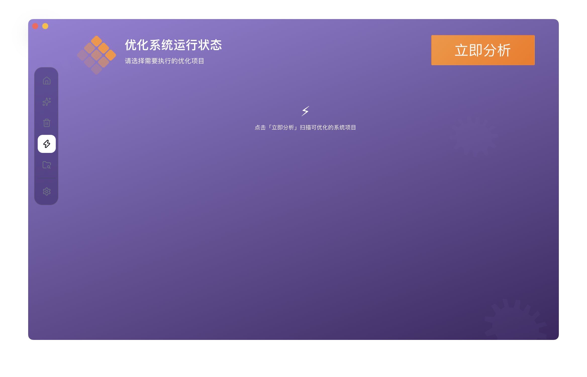
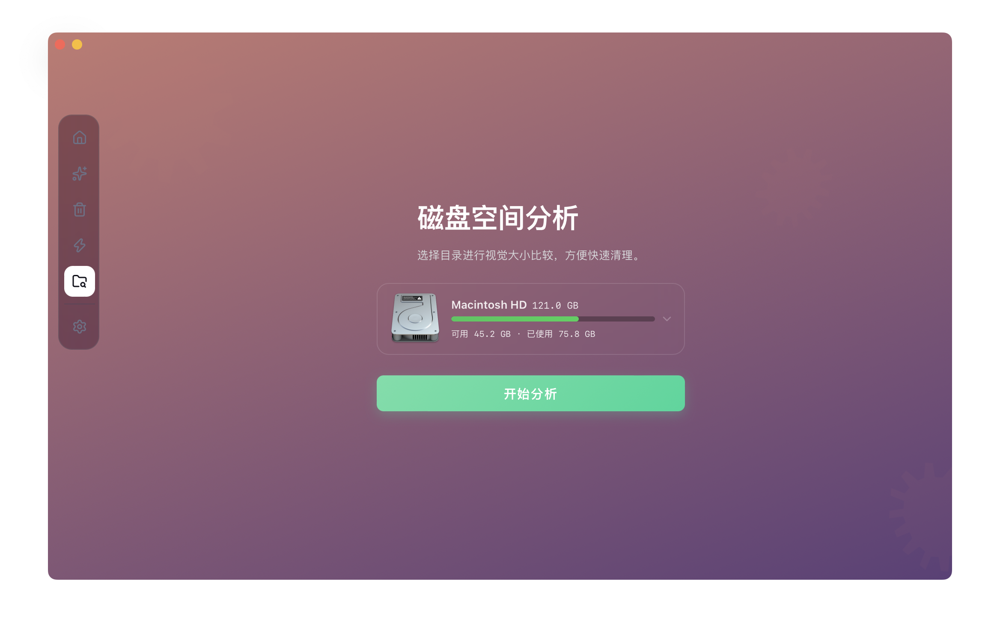

<div align="center">
  <h1>Molan</h1>
  <p><em>🐹 一款原生 macOS 清理 / 优化应用 —— 深度清理、智能卸载、系统维护与磁盘透视，为普通用户打造的图形界面。</em></p>
</div>

<p align="center">
  
  
  
  
</p>

<p align="center">
  <a href="https://github.com/tiyongLit/Molan"></a>
  <a href="https://gitee.com/tiyong/Molan"></a>
</p>

<p align="center">
  <a href="./README.md">English</a> | 简体中文
</p>

> 💡 **Molan** 是一款帮助你在 Mac 上完成清理、卸载、优化与磁盘洞察的 GUI 应用。其扫描与清理逻辑是对开源命令行工具 [`tw93/Mole`](https://github.com/tw93/Mole) 的 **Rust 完整重写**，并围绕原生桌面体验重构：可视化分类、勾选框、结果预览、显式确认、一键回收空间 —— 全程无需打开终端。

<p align="center">
  
</p>

<p align="center">
  
  
</p>

<p align="center">
  
  
</p>

## 为什么做 Molan

原版 Mole CLI 已经证明：一个工具就能替代 CleanMyMac、AppCleaner、DaisyDisk 和 iStat Menus —— 但它活在终端里，而大多数 Mac 用户从不打开终端。

Molan 继承了同一套久经考验的规则与算法，把整个引擎用 Rust 重写（不嵌入任何外部二进制、不调用任何 Shell 脚本），再封装进一个精致的 Tauri 图形界面，按照人们真实的清理习惯来设计：

- **先看后删。** 扫描永远无副作用。结果按分类聚合，展示大小、文件数与原生文件图标，供你勾选确认后才动手。
- **不经你同意，什么都不删。** 所有删除统一移入废纸篓，任何破坏性操作都必须显式确认。
- **为 GUI 用户增强。** CLI 里是交互式 TUI 列表，Molan 换成了可展开的目录树、「自动选中 / 需人工复核」分组、删除历史、菜单栏仪表盘，以及卸载残留智能检测。

## 功能

### 🧹 深度清理

扫描已知安全的缓存、日志、浏览器数据、开发者产物、设备残留与大文件，按类别聚合（系统、应用、浏览器与云、开发者工具、设备、大文件）。任意分类可展开逐条查看路径、单独勾选、保护想保留的条目，一键完成清理。

### 🗑 智能卸载

卸载 `/Applications` 中的应用，并连带清掉它们留下的偏好设置、缓存、容器与启动项 —— 还提供 CLI 给不了的安全网：

- **残留检测** —— 当你手动把应用拖进废纸篓后，Molan 会主动提示扫描并清理其残留文件。
- **自动选中 vs. 需复核** —— 残留文件被拆分为「可放心删除」与「请先复核」两组，共享数据绝不会被静默移除。
- **同族应用保护** —— 共享同一 Bundle ID 的应用（如 Xcode 与 Xcode-beta）其共享数据会被完整保留。
- **仅清除数据** —— 不卸载应用，只重置它的数据状态。
- **删除历史** —— 每次卸载都有记录，一键打开废纸篓找回。

### 🔄 启动项与孤儿文件

同一个页面还管理：

- **启动项** —— 登录项与 Launch Agent / 服务，按来源标记（Homebrew / 用户 / 厂商 / 系统），可逐条启用或禁用。
- **孤儿文件** —— 找出已被卸载应用遗留的文件，移入废纸篓。

### ⚡ 系统优化

带实时性能诊断（高 CPU、内存压力、失控进程）的引导式维护流程：先分析网络、磁盘、Spotlight、应用数据库、启动与数据服务，以任务清单形式预览，再流式日志执行；不必要或不安全的任务会被跳过并说明原因。

### 📊 磁盘透视

可视化磁盘浏览器：用并行 Rust 遍历器扫描任意卷或目录，再以 **Treemap** 下钻查看占用。Top 20 大文件、路径过滤、Quick Look、在 Finder 中显示、确认后移入废纸篓 —— DaisyDisk 式的工作流，内置完成。

两种统计口径，每次扫描可切换：**logical 逻辑大小**（与 Finder 展示一致）与 **physical 物理占用**（磁盘真实占用，对齐 Mole 口径）。

### 📈 实时状态与菜单栏仪表盘

菜单栏常驻仪表盘，实时展示 CPU、温度、风扇转速、内存（支持按进程退出）、磁盘与网络；并内置废纸篓体积提醒 —— 当废纸篓超过你设定的阈值时自动弹出。

### ⚙️ 为日常使用而生

- **原生观感** —— 通过内容寻址图标注册表渲染真实的 macOS 文件与应用图标，配合原生系统弹窗与菜单栏工作流。
- **自动更新** —— 带签名的应用内更新（Tauri updater，GitHub / Gitee 双源）。
- **开机自启**、可配置的更新检查频率，以及完整的 **多语言** 体系（English、简体中文、繁體中文）。

## 安全与隐私

Molan 的设计原则是：清理工具本身绝不能成为新的麻烦。

- **走废纸篓，绝不 `rm`。** 所有删除都进入系统废纸篓，随时可恢复。
- **扫描 ≠ 删除。** 扫描只读；清理仅发生在你勾选并确认之后。
- **规则编译期内嵌。** 清理规则随二进制一起编译进包（`embedded_rules.rs`），可在 Git 中审计 —— 不下载远端规则，不做热更新行为。
- **零外部二进制。** 整个引擎是纯 Rust —— 不捆绑 CLI、不 shell-out、不用 AppleScript。这也是本应用能干净通过 Mac App Store 沙箱合规的前提。
- **数据全在本地。** 不上传任何内容，无遥测、无账号。你的磁盘内容永远不出这台 Mac。

## 架构

一套 Rust 引擎，一个 GUI，单一发行版本。

```
├── src/                    # 前端 —— React 19 + TypeScript（strict）
│   ├── layout/             #   应用外壳（Sidebar、Dock、Shell*）
│   ├── pages/              #   首页 · 清理 · 卸载 · 优化 · 磁盘透视 · 设置 · 仪表盘
│   ├── components/         #   通用 UI（Mole*）、业务组件、动效零件
│   ├── hooks/              #   useTauri、useNativeIcon 等
│   └── i18n/               #   en-US · zh-CN · zh-TW
└── src-tauri/              # 后端 —— Tauri 2 + Rust
    ├── src/lib/            #   引擎：clean · uninstall · optimize · core · manage · check · platform
    ├── src/cmd/            #   analyze（并行磁盘遍历）· status（sysinfo 采集）
    ├── src/controllers/    #   薄层 #[tauri::command] 入口
    └── src/embedded_rules.rs  # 编译期内嵌清理规则
```

设计要点：

- **全部逻辑用 Rust。** 路径规则、大小口径、保护名单、容器解析均对标 [`tw93/Mole`](https://github.com/tw93/Mole) —— 是重新实现，而非嵌入。
- **重 I/O 离开主线程。** 阻塞型扫描走 `spawn_blocking`；磁盘遍历用 `rayon` + work-stealing 队列并行，整盘扫描做到秒级可感知。
- **流式进度。** 长任务通过 Tauri 事件推送进度，前端订阅，不做轮询。
- **类型化契约。** 每个命令与事件名都登记在 `src/constants/tauri-commands.ts` / `tauri-events.ts`，共享数据结构定义在 `src/types/mole.ts`。

## 快速开始

Molan 面向 **macOS 12+**（Intel 与 Apple Silicon）。开发环境需要带 Xcode Command Line Tools 的 macOS、[Node.js](https://nodejs.org) 20+、[pnpm](https://pnpm.io)，以及较新的 [Rust](https://rustup.rs) 工具链。

源码同时托管在 GitHub 与 Gitee，哪个快用哪个：

```bash
# GitHub
git clone https://github.com/tiyongLit/Molan.git
# Gitee（国内访问更快）
git clone https://gitee.com/tiyong/Molan.git

cd Molan
pnpm install
pnpm tauri:dev          # 开发模式启动（数据目录隔离在仓库内）
```

构建生产包：

```bash
pnpm build:mac                # 双架构（M 芯片 + Intel）两个 dmg → release/
pnpm build:mac:arm            # 仅 M 芯片（aarch64）
pnpm build:mac:intel          # 仅 Intel（x86_64）
pnpm tauri build              # 原生 Tauri 构建（仅当前主机架构）
```

`pnpm build:mac` 为两个架构分别产出带版本号的 dmg 并收集到 `release/` 目录。版本号以 `package.json` 为唯一事实源，构建前自动同步到 `tauri.conf.json` 与 `Cargo.toml`。所有构建产物统一做 **ad-hoc 代码签名**（Tauri 的 `signingIdentity: "-"`），并在收集产物前由构建脚本强制校验。

**macOS 权限说明。** macOS 按代码签名身份识别应用并记录隐私（TCC）授权 —— 没有有效签名的 app 无法读取废纸篓等受保护资源，给什么权限都不生效。因此「废纸篓体积提醒」需要在 **完全磁盘访问权限**（系统设置 → 隐私与安全性）中授权：首次授权一次，每次升级后需重做一次（移除旧条目后重新添加，并重启应用）。从网络下载的 dmg 未经公证：首次打开请用**右键 → 打开**。

参与贡献：提交前运行 `pnpm format`（prettier + rustfmt，pre-commit 钩子也会自动执行）。

## 路线图

- [ ] Mac App Store 上架（沙箱 + Security-Scoped Bookmark）
- [ ] Developer ID 签名与公证（替代 ad-hoc 签名，实现跨版本稳定授权与无拦截分发）
- [ ] 通过 Security-Scoped Bookmark 引导授权扩大扫描范围
- [ ] Purge（项目构建产物清理）与 Installer（安装包清理）的 GUI
- [ ] 自定义规则导入（严格校验，仅影响用户显式授权路径）

## 致谢

- [**tw93/Mole**](https://github.com/tw93/Mole) —— 本项目所依据的规则、分类与算法来源的开源 CLI。去给它点个 Star。
- [**腾讯柠檬清理 Lemon Cleaner**](https://github.com/Tencent/lemon-cleaner) —— 分类面板与勾选交互、信息架构的参考基准。

## 许可证

Molan 采用 [MIT 许可证](LICENSE)。

清理逻辑的灵感来自 [`tw93/Mole`](https://github.com/tw93/Mole)（GPL-3.0）；Molan 以 Rust 重新实现其行为，并未链接或嵌入原始代码。
